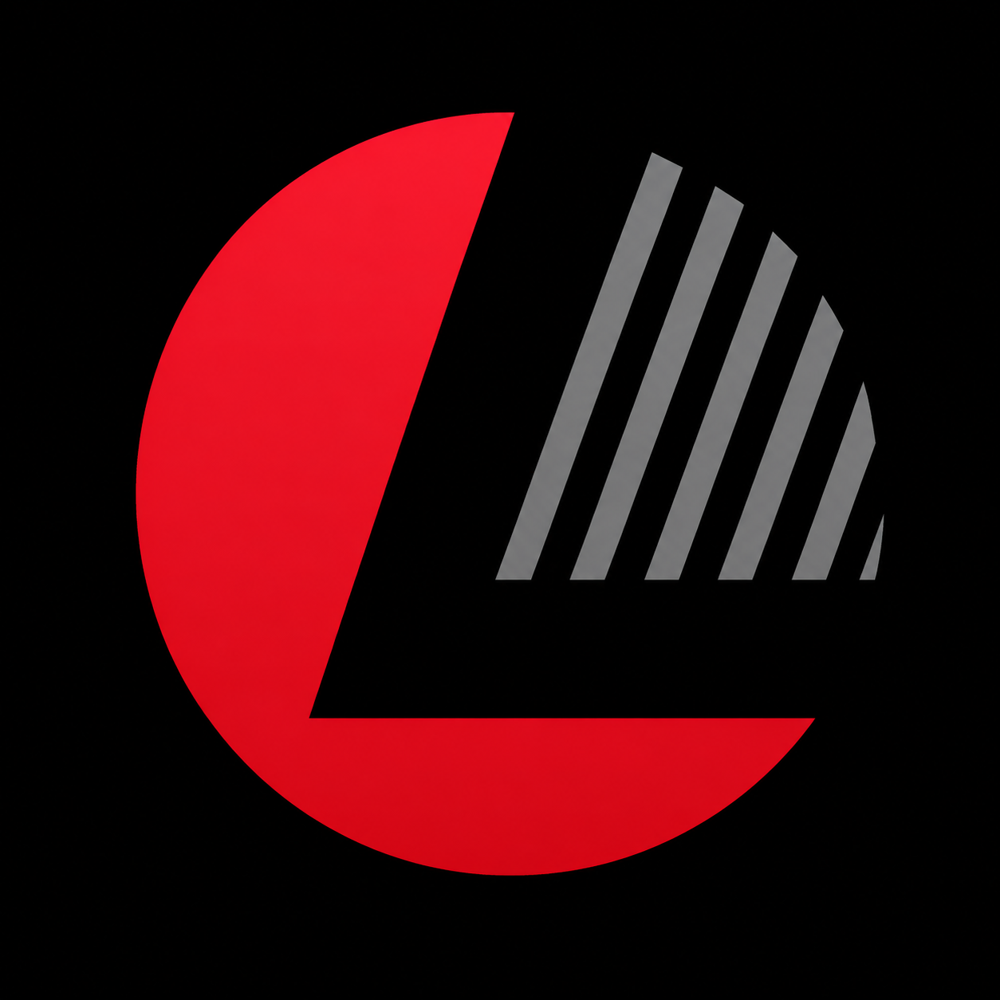

  

<h1 align="center">Loyal Trade Management Ltd.</h1>

  <strong>People. Technology. Performance.</strong>

  Workforce Solutions · Talent Acquisition · HR Technology · AI & Automation · Digital Transformation

  <a href="https://www.loyaltrademanagement.com">Corporate Website</a>

  

---

## About Us

Loyal Trade Management Ltd. is a technology-driven workforce and business solutions company helping organizations transform the way they attract talent, manage people, adopt technology, and achieve sustainable growth.

We combine expertise in workforce management, talent acquisition, HR solutions, artificial intelligence, automation, cloud technologies, and digital transformation to create smarter, more connected, and higher-performing organizations.

> **Enable People. Empower Businesses. Accelerate Performance.**

---

## Our Vision

To be a trusted leader in workforce innovation, HR technology, artificial intelligence, and digital transformation, helping organizations build future-ready workplaces and achieve sustainable growth.

---

## Our Mission

### Empowering Businesses Through People, Technology, and Innovation

Our mission is to help organizations:

- Build stronger and more capable workforces
- Improve operational efficiency
- Adopt modern technology and intelligent automation
- Enhance employee and customer experiences
- Create measurable and sustainable business value

Through practical expertise, innovative solutions, and a people-first approach, we help businesses prepare for the future of work.

---

## Our Services

### Workforce Solutions

Strategic workforce planning, workforce management, organizational support, and workforce optimization services designed to improve productivity and operational effectiveness.

### Recruitment & Talent Acquisition

Modern recruitment and talent acquisition solutions that connect employers with qualified talent through strategic sourcing, candidate engagement, talent intelligence, and workforce planning.

### HR Compliance & Advisory

Professional HR consulting, policy development, compliance support, employee relations guidance, and workforce best practices that help organizations operate confidently and responsibly.

### Payroll & Workforce Management

Technology-enabled payroll administration, attendance management, workforce coordination, and employee lifecycle management solutions.

### AI & Automation Services

Intelligent solutions that automate repetitive processes, improve decision-making, enhance productivity, and create operational efficiencies across organizations.

### Digital Transformation

Helping businesses modernize operations through cloud technologies, digital workplace solutions, process automation, data-driven insights, and innovation-led transformation initiatives.

---

## Technology & Innovation

We help organizations adopt and integrate modern technologies across:

- Artificial Intelligence (AI)
- Workforce Intelligence
- HR Technology
- Talent Acquisition Technology
- Business Process Automation
- Microsoft Azure
- Microsoft 365
- Cloud Infrastructure
- Data & Analytics
- Digital Workplace Solutions
- Collaboration & Productivity Platforms
- Intelligent Business Applications

Our technology initiatives are designed to help organizations improve efficiency, strengthen collaboration, make better decisions, and achieve sustainable business success in a rapidly evolving digital economy.

---

## Talent Bridge BD (TBBD)

### Technology-Powered Workforce Innovation

**Talent Bridge BD (TBBD)** is a strategic workforce and technology initiative of Loyal Trade Management Ltd.

TBBD connects talent, employers, workforce operations, and intelligent technology through a unified ecosystem supporting:

- Talent Acquisition
- Workforce Solutions
- HR Technology
- Artificial Intelligence
- Workforce Intelligence
- Automation
- Digital Workplace Transformation

By combining workforce expertise with innovative technology, TBBD helps organizations build stronger teams, improve workforce performance, and enhance employee experiences.

---

## Our Technology Ecosystem

Our technology initiatives leverage modern cloud and digital platforms to support secure, scalable, and intelligent business solutions.

Key technology areas include:

**Microsoft Azure · Microsoft 365 · Artificial Intelligence · Automation · Data & Analytics · Cloud Infrastructure · Digital Workplace · Intelligent Business Applications**

---

## Why Organizations Choose Us

### People First

We believe every successful transformation begins with people.

### Technology Driven

We leverage modern cloud, AI, automation, and workplace technologies to solve real business challenges.

### Innovation Focused

We continuously explore and apply emerging technologies that create measurable business outcomes.

### Business Oriented

Every solution we deliver is aligned with organizational goals, operational requirements, and long-term growth objectives.

### Future Ready

We help organizations prepare for the evolving workplace and digital economy.

---

## Our Approach

**People → Technology → Intelligence → Automation → Performance**

We believe technology creates the greatest value when it is designed around people and aligned with business objectives.

By combining workforce expertise, intelligent technology, and innovation, we help organizations transform the way they work, collaborate, and grow.

---

## Our Commitment

At Loyal Trade Management Ltd., we are committed to helping organizations build smarter workplaces, empower their workforce, embrace innovation, and achieve lasting business success.

> **Together, we are shaping the future of work.**

---

## Corporate Website

🌐 **https://www.loyaltrademanagement.com**

---

## Loyal Trade Management Ltd.

**People. Technology. Performance.**

**Workforce Solutions | Talent Acquisition | HR Technology | AI & Automation | Digital Transformation**

© 2026 Loyal Trade Management Ltd. All Rights Reserved.
