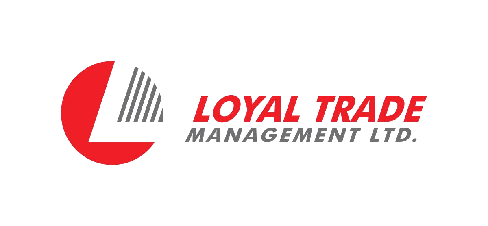

<p align="center">
  
</p>

<h1 align="center">Loyal Trade Management Ltd.</h1>

<p align="center">
  <strong>People. Technology. Performance.</strong>
</p>

<p align="center">
  Workforce Solutions · Talent Acquisition · HR & HCM · Technology · AI & Automation · Digital Innovation
</p>

<p align="center">
  <a href="https://www.loyaltrademanagement.com">
    Corporate Website
  </a>
</p>

<p align="center">
  
</p>

---

## About Loyal Trade Management Ltd.

Loyal Trade Management Ltd. is a workforce and technology solutions company helping organizations build stronger teams, improve operations, and achieve sustainable growth.

We combine workforce expertise, recruitment and talent acquisition capabilities, technology solutions, artificial intelligence, automation, cloud technologies, and digital innovation to create practical solutions for modern organizations.

> **Empowering Organizations Through People, Technology & Performance.**

---

## Our Vision

To become a trusted organization recognized for delivering impactful workforce and technology solutions that create lasting value for organizations and professionals.

---

## Our Mission

### Empowering Businesses Through People, Technology & Innovation

Our mission is to create meaningful business value by connecting:

- People
- Technology
- Innovation
- Workforce capabilities
- Business performance

We help organizations adapt to changing business environments by combining practical workforce expertise with modern technology and digital innovation.

---

## Our Services

### Workforce Solutions

Helping organizations find, develop, and connect with the right talent through structured workforce services, recruitment, talent acquisition, and workforce support.

### Recruitment & Talent Acquisition

Connecting organizations with qualified professionals through structured sourcing, candidate engagement, recruitment, and talent acquisition solutions.

### International Workforce Solutions

Supporting organizations with workforce strategies and skilled talent solutions designed for evolving local and international employment requirements.

### HR & Workforce Support

Helping businesses improve workforce operations through practical HR processes, workforce support, and technology-enabled approaches.

### Technology Solutions

Supporting modern organizations with cloud, infrastructure, artificial intelligence, automation, data, and digital technology solutions.

---

## Technology & Digital Innovation

Technology is an important part of how we help organizations modernize their operations.

Our technology capabilities include:

- Artificial Intelligence
- AI-Enabled Workforce Solutions
- Cloud & Infrastructure
- Digital Workplace & HR Technology
- Data Analytics & Business Intelligence
- Intelligent Business Applications
- Automation & Integration
- Microsoft Azure
- Microsoft 365
- Digital Transformation

We focus on practical technology solutions that improve efficiency, strengthen collaboration, support better decision-making, and enable sustainable business growth.

---

## Talent Bridge BD (TBBD)

### Connecting Talent With Global Opportunities

Talent Bridge BD (TBBD) is a strategic initiative of Loyal Trade Management Ltd. focused on connecting skilled professionals with global employment opportunities.

TBBD combines workforce expertise, recruitment capabilities, and technology-enabled processes to create a modern workforce ecosystem connecting:

- Employers
- Candidates
- Workforce partners
- Talent acquisition
- HR technology
- Digital workforce solutions

Through technology and workforce innovation, TBBD supports organizations in identifying and engaging talent while helping professionals discover new opportunities.

---

## Our Technology Ecosystem

Our technology initiatives leverage modern cloud and digital platforms to support secure, scalable, and intelligent business solutions.

Key technology areas include:

**Microsoft Azure · Microsoft 365 · Artificial Intelligence · Automation · Data & Analytics · Cloud Infrastructure · Digital Workplace · HR Technology · Intelligent Business Applications**

---

## Why Choose Us

### People First

We believe people are the foundation of every successful organization.

### Technology Driven

We use modern technology to support smarter business operations and better workforce experiences.

### Innovation Focused

We continuously explore practical ways to apply technology and innovation to real business challenges.

### Business Oriented

Our solutions are designed around organizational requirements, operational needs, and long-term business objectives.

### Long-Term Partnership

We build sustainable relationships through trust, professionalism, innovation, and results.

---

## Our Approach

### People → Technology → Intelligence → Automation → Performance

We believe technology creates the greatest value when it is designed around people and aligned with business objectives.

By combining workforce expertise, intelligent technology, and innovation, we help organizations improve the way they work, collaborate, and grow.

---

## Our Commitment

At Loyal Trade Management Ltd., we remain committed to helping organizations build stronger teams, modernize operations, embrace technology, and achieve sustainable growth.

We combine human expertise with technology and innovation to create practical solutions that deliver meaningful business value.

> **Together, we are shaping the future of work.**

---

## Website

🌐 **https://www.loyaltrademanagement.com**

---

## Project Structure

```text
loyaltrademanagement-website/
│
├── index.html
├── about.html
├── services.html
├── technology.html
├── tbbd.html
├── careers.html
├── contact.html
├── privacy.html
├── terms.html
├── styles.css
├── README.md
│
└── assets/
    ├── logo-transparent.png
    ├── Hero-image.jpeg
    ├── AI-Enabled Workforce Solutions.jpeg
    ├── Cloud & Infrastructure.jpeg
    └── TBBD.jpeg
